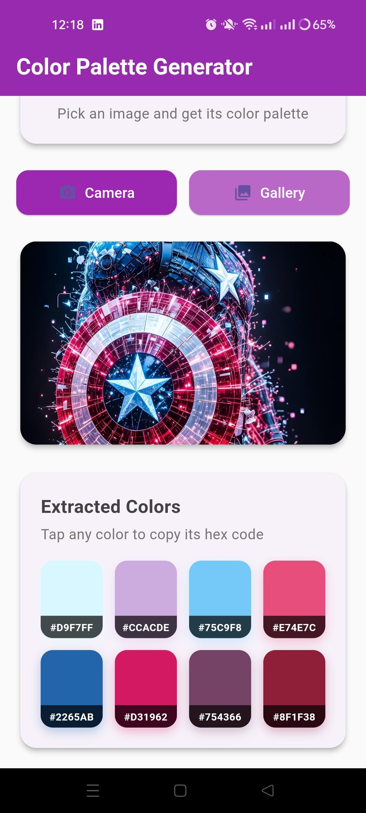
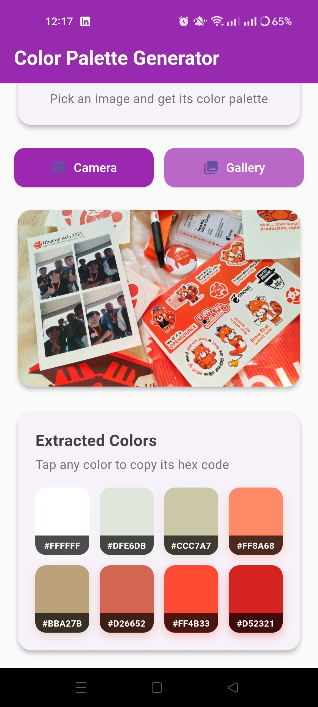
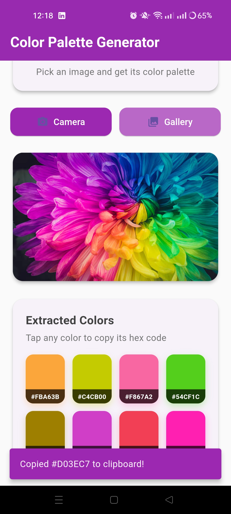
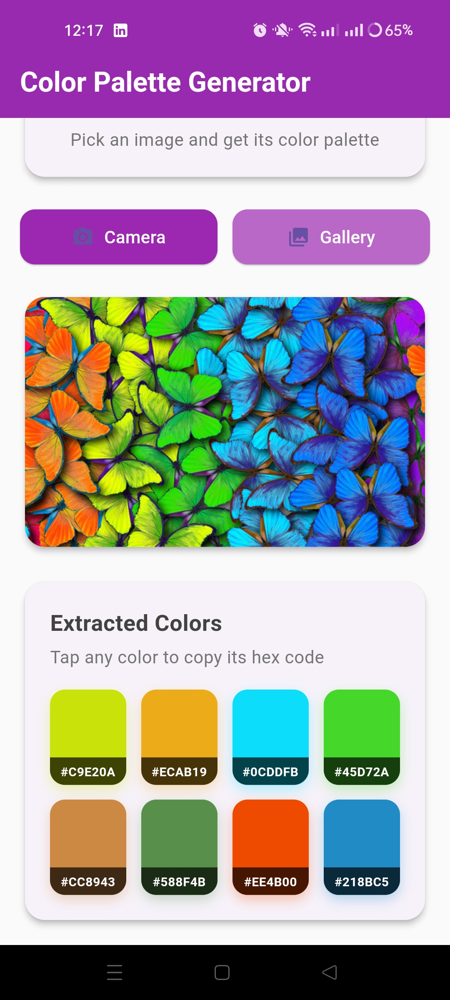

# 🎨 Flutter Color Palette Generator

<div align="center">
  
  
  
  
  
  **A beautiful, intuitive color palette generator built with Flutter**
  
  *Discover, create, and export stunning color palettes with ease*

</div>

---

## 🌈 Overview

This Flutter Color Palette Generator is a sleek, minimal mobile application that empowers designers, developers, and artists to create beautiful color combinations effortlessly. With an intuitive interface and powerful generation algorithms, discovering the perfect palette has never been easier.

## 🎬 Intro

<div align="center">
  
  [](https://www.youtube.com/watch?v=YOUR_VIDEO_ID)
    
</div>

## ✨ Features

### 🎨 **Interactive Design**
- Tap to generate new palettes
- Swipe gestures for easy navigation
- Real-time color preview
- Custom color picker integration

### 💾 **Export & Share**
- Save palettes to favorites
- Export in multiple formats (HEX, RGB, HSL)
- Share palettes directly from the app
- Copy individual colors with one tap

### 🎭 **Customization**
- Multiple generation algorithms
- Adjustable palette sizes
- Color temperature controls
- Accessibility-friendly options

## 📱 Screenshots
<div align="left">
  <table>
    <tr>
      <td></td>
      <td></td>
      <td></td>
      <td></td>

  </table>
</div>

## 🚀 Getting Started

### Prerequisites

- Flutter SDK (>=3.0.0)
- Dart SDK (>=3.0.0)
- Android Studio / VS Code
- iOS Simulator / Android Emulator

### Installation

1. **Clone the repository**
   ```bash
   git clone https://github.com/yourusername/flutter-color-palette-generator.git
   cd flutter-color-palette-generator
   ```

2. **Install dependencies**
   ```bash
   flutter pub get
   ```

3. **Run the application**
   ```bash
   flutter run
   ```

### Build for Production

```bash
# Android
flutter build apk --release

# iOS
flutter build ios --release
```

## 📊 Key Components

### Color Engine
- HSL/RGB/HEX conversion utilities
- Color harmony calculations
- Palette generation algorithms
- Color accessibility validation

### UI Components
- Custom color swatch widgets
- Smooth transition animations
- Gesture-based interactions
- Responsive grid layouts

## 📚 Resources

- [Color Theory Basics](https://www.colormatters.com/color-and-design/basic-color-theory)
- [Flutter Documentation](https://docs.flutter.dev/)
- [Material Design Colors](https://material.io/design/color/)
- [Accessibility Guidelines](https://www.w3.org/WAI/WCAG21/quickref/)

## 📝 License

This project is licensed under the MIT License - see the [LICENSE](LICENSE) file for details.

## 🙏 Acknowledgments

- Flutter team for the amazing framework
- Color theory experts and resources
- Open source color libraries
- Design community feedback

## 📞 Contact

**Your Name** - [@Hom](https://x.com/KishanP07684084) - pathakhom17@gmail.com

Project Link: [https://github.com/yourusername/flutter-color-palette-generator](https://github.com/yourusername/flutter-color-palette-generator)

---

<div align="center">
  
  **⭐ Star this repo if you found it helpful!**
  
  Made with 💖 and Flutter
  
</div>
